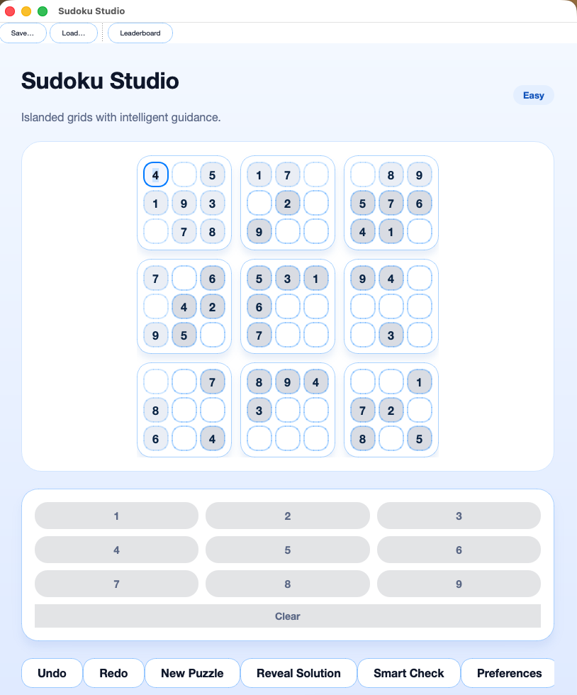

# Suduku-LLM

Suduku-LLM is a feature-rich Sudoku toolkit that combines performant puzzle generation, a backtracking solver, and two interactive user interfaces. The project ships with both a lightweight Tkinter experience and an immersive, modern PyQt5 desktop application that showcases live validation, history tracking, virtual keyboard input, and leaderboard capabilities. Developers can embed the solver, drive the command-line tools, or extend the graphical interfaces to create custom Sudoku experiences.

---

## Feature Highlights

- **Deterministic solver core** – Depth-first backtracking solver with pruning, reusable across interfaces and scripts.
- **Configurable puzzle generator** – Difficulty presets (`easy`, `medium`, `hard`) tuned by removal counts with solvability checks.
- **Two complete GUIs**  
  - *Classic*: minimal Tkinter grid suitable for quick testing or teaching.  
  - *Modern*: PyQt5 experience with theming, smart validation, undo/redo history, virtual keypad, and leaderboard integration.
- **Command-line tooling** – Generate, solve, or demo puzzles directly from the terminal for automation workflows.
- **Test coverage** – Pytest suite validating solver correctness and generator constraints.
- **Extensible structure** – Clear module boundaries to support further UX work, AI-assisted solving, or puzzle export formats.

---

## Architecture Overview

| Component | Module | Responsibilities |
|-----------|--------|------------------|
| Core engine | `sudoku/core.py` | Board representation, solver, generator, validation helpers. |
| Classic GUI | `sudoku/gui.py` | Tkinter implementation with basic controls (new, solve, check). |
| Modern GUI | `sudoku/gui_modern/` | PyQt5 application with modular widgets, session tracking, and theming. |
| CLI utilities | `cli.py` | Subcommand-based interface for generate/solve/demo operations. |
| Tests | `tests/` | Pytest regressions for solver logic and puzzle generation. |

Supporting assets such as themes, fonts, and leaderboard persistence are scoped under `sudoku/gui_modern/`.

---

## Requirements

- Python **3.9+**
- Tk bindings (ships with standard CPython distributions; macOS users should prefer the official Python.org installer or install `python-tk` via Homebrew).
- PyQt5 (installed via `pip`).

Optional but recommended:

- A Python virtual environment (`venv`, `virtualenv`, or Poetry) to isolate dependencies.
- `pytest` for executing the automated test suite.

---

## Installation

1. **Clone or download** this repository to your workstation.
2. **Create a virtual environment** (optional but encouraged):
   ```bash
   python3 -m venv .venv
   source .venv/bin/activate
   ```
3. **Install project dependencies**:
   ```bash
   pip install -r requirements.txt
   ```
   This command pulls in Tkinter bindings (where available) and PyQt5 for the modern UI.
4. **Install development tooling** (optional):
   ```bash
   pip install pytest
   ```

---

## Usage

### Launching the Classic Tkinter GUI

The classic experience is intentionally lightweight and mirrors traditional Sudoku grid interactions.

```bash
python3 run.py
```

Features include puzzle generation, brute-force solving, and validity checks within a minimal interface.

### Launching the Modern PyQt5 GUI

For a richer user experience featuring customizable themes, smart validation, undo/redo controls, and leaderboard integration:

```bash
python3 run.py --modern
```

On first launch you will be prompted to enter a username for leaderboard tracking. Navigation is optimized for keyboard and mouse input, and all controls provide immediate feedback through the status bar.



### Command-Line Interface

Use the CLI when you need scripted generation or solver access without a GUI.

```bash
python3 cli.py --help
python3 cli.py generate medium
python3 cli.py solve < puzzles/board.sdk
python3 cli.py demo hard
```

The `solve` subcommand reads a board from standard input. Provide nine lines of nine digits (`0` or `.` for blanks). The output includes the original puzzle and the solved grid.

---

## Testing & Quality Assurance

The test suite validates key behaviours of the solver and generator.

```bash
pytest -q
```

To run only logic validation without installing PyQt5, you may limit dependencies to `tk` and `pytest`. Graphical tests are manual; launch both GUIs to ensure your environment has correct windowing support.

---

## Project Structure

```
Suduku-LLM/
├── cli.py
├── run.py
├── requirements.txt
├── sudoku/
│   ├── __init__.py
│   ├── core.py
│   ├── gui.py
│   └── gui_modern/
│       ├── board.py
│       ├── dialogs.py
│       ├── fonts.py
│       ├── keyboard.py
│       ├── leaderboard.py
│       ├── main_window.py
│       ├── models.py
│       ├── session.py
│       └── themes.py
├── tests/
└── test-01.sdk
```

`test-01.sdk` is a sample puzzle resource that can be loaded via the GUI or CLI for demonstrations.

---

## Troubleshooting

- **`ImportError: No module named PyQt5`** – Ensure `pip install -r requirements.txt` completed successfully inside your active environment.
- **Tkinter fails to launch on macOS** – Install the official Python distribution from python.org or run `brew install python-tk`.
- **GUI window is blank or closes immediately** – Verify that your display server is available (for example, enable X11 forwarding when SSH-ing into remote hosts).
- **Puzzle generation raises `ValueError`** – Confirm that the difficulty string is one of `easy`, `medium`, or `hard`.

---

## Development Guidelines

- Follow PEP 8 style conventions; type hints are used extensively across the codebase.
- Run `pytest` before submitting changes to avoid regressions in the solver logic.
- Contributions that enhance the modern UI should preserve modularity within `sudoku/gui_modern/` and maintain compatibility with existing configuration files.
- When adding new puzzle assets, prefer the `.sdk` format (9 lines of 9 digits) for consistency with existing tooling.

---

## Support & Contact

Bug reports, feature requests, and general questions are welcome. Open an issue or reach out via your preferred development channel so we can continue refining Suduku-LLM.
